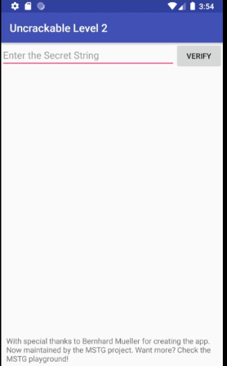
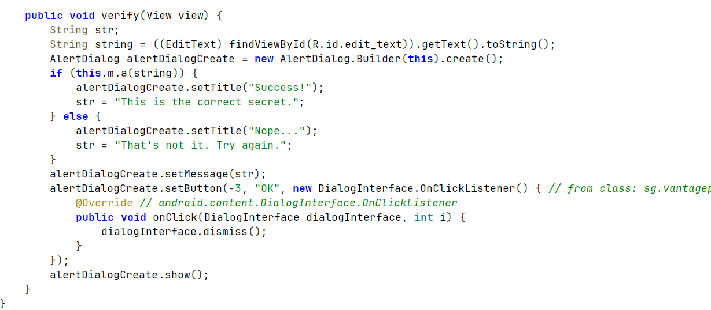
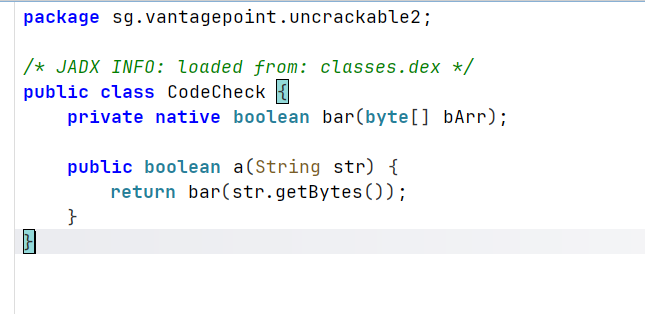
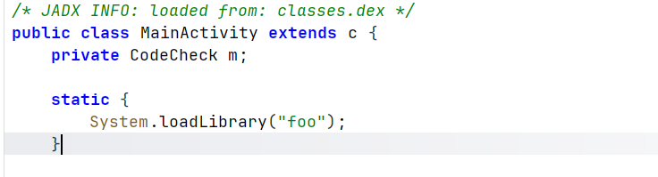
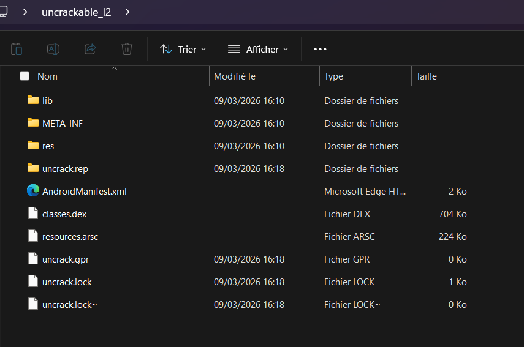
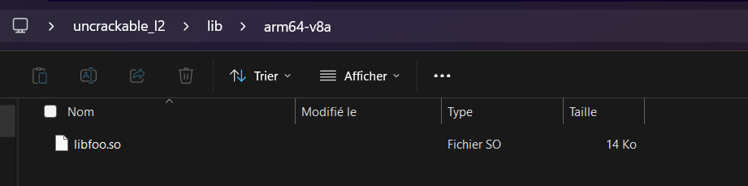
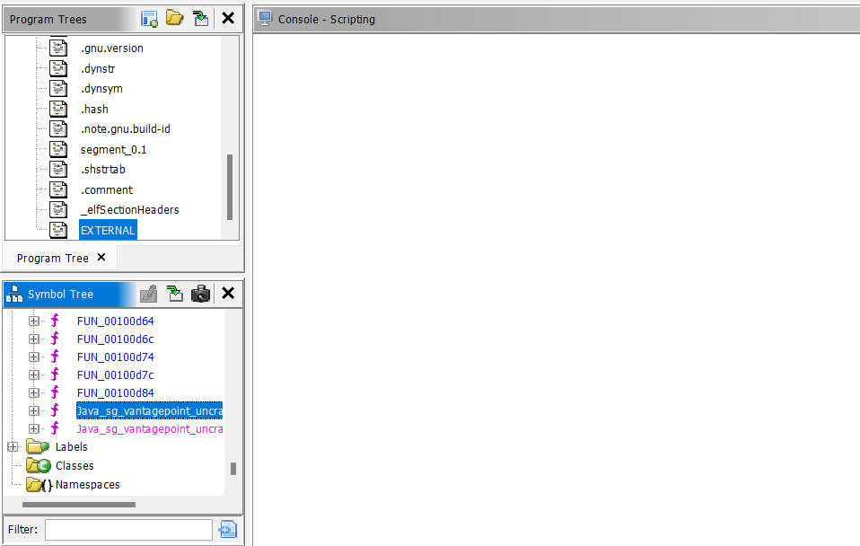
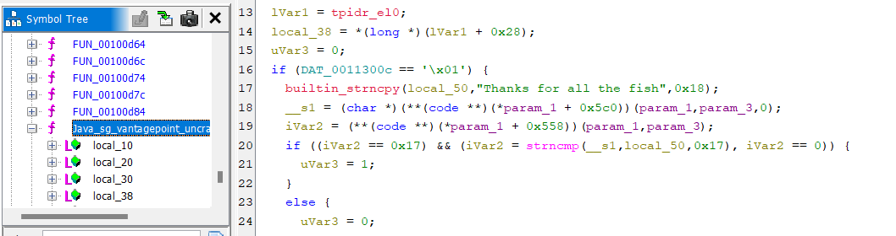
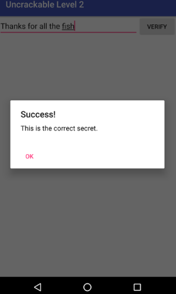

# Reverse Engineering – UnCrackable Level 2

## Introduction

Ce laboratoire a pour objectif de comprendre le fonctionnement interne d’une application Android et d’introduire les bases du **reverse engineering**.  
À travers l’analyse d’un fichier APK, il s’agit d’observer le comportement de l’application, d’identifier les mécanismes de vérification présents dans le code et d’étudier l’utilisation de bibliothèques natives.

---

# Outils utilisés

Les outils suivants sont nécessaires pour réaliser ce laboratoire :

- **ADB (Android Debug Bridge)**  
- **JADX** – décompilation du code Java  
- **Ghidra** – analyse de la bibliothèque native  

---

## Installation de l'application

Après l’installation de l’application **Uncrackable Level 2** dans notre **AVD** via la commande : adb install /path/de/Uncrackable-Level2.apk. Nous avons constaté que l’objectif final de ce challenge est de trouver le **mot secret** que l’application va accepter afin de terminer le challenge.

---

## Analyse statique avec JADX

Nous avons commencé par lancer **JADX-GUI** afin d’analyser statiquement notre APK.

Le point de départ est naturellement la classe **MainActivity**, car c’est le point de départ de la logique côté interface.  
C’est à cet endroit que l’entrée utilisateur est récupérée puis envoyée à la logique de vérification.

---

On trouve cette fonction qui récupère la valeur saisie par l’utilisateur et appelle une méthode de vérification. Si la valeur correspond au secret attendu, un message de succès est affiché. Sinon, l’application indique que la réponse est incorrecte.

Nous suivons ensuite simplement la logique des classes pour trouver la fonction **"CodeCheck"**, qui nous donne un premier indice indiquant que l’application utilise du **code natif** (mot-clé `native`), généralement écrit en **C ou C++**.  

Le deuxième indice, qui va nous guider plus clairement, est l’import d’une bibliothèque appelée **"foo"** dans la classe **MainActivity**.

L’appel `System.loadLibrary("foo")` indique qu’un fichier nommé **libfoo.so** doit exister dans l’APK. C’est pour cette raison que nous avons extrait le contenu de l’APK.

Après une simple recherche, nous avons trouvé cette bibliothèque, que nous allons ouvrir à l’aide de **Ghidra**.

## Analyse avec Ghidra

Après extraction de la bibliothèque native et son ouverture dans **Ghidra**, nous pouvons identifier la fonction exportée **"Java_sg_vantagepoint_uncrackable2_CodeCheck_bar"**.  
Cette fonction montre que l’application compare la chaîne saisie avec la valeur **"Thanks for all the fish"** en utilisant la fonction `strncmp`.  

Si les deux chaînes correspondent, la fonction retourne **true** et l’application valide le secret.

Finalement, nous vérifions la chaîne que nous avons trouvée (**Thanks for all the fish**), ce qui retourne un résultat positif.

